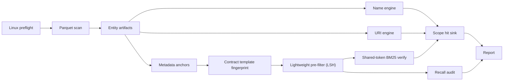

# name_uri_analysis_rs rewrite architecture

This document uses [`REWRITE_DESIGN.md`](./REWRITE_DESIGN.md) as the single source of business
requirements and defines the module boundaries, data protocols and execution flow of the rewritten
program.

The new program is implemented from scratch. It does not import, call, or stay compatible with the
original `name_uri_analysis_rs` code, modules, intermediate files, or hidden conventions.

## 1. Runtime background and boundaries

### 1.1 Production environment

Production runs assume Linux:

- 64-bit Linux;
- cgroup v2;
- readable cpuset, CPU topology and NUMA topology;
- a local POSIX file system;
- local NVMe as the temporary data disk;
- a target budget of 128 vCPU and 512 GiB RAM.

The program must treat the resources actually granted by cgroup and cpuset as authoritative, not the
host's physical resources. Temporary directories must not sit on NFS, SMB or other network file
systems.

Non-Linux environments are only for development and small-scale testing and are not a production
target.

### 1.2 Input and output boundaries

- Input accepts only the Parquet snapshot defined by the design document.
- No chain database connection and no online queries.
- No re-normalization of `name_norm`, `token_uri_norm` and `image_uri_norm`.
- Output depends only on versioned artifacts produced by the current run.
- Digests are used for grouping and validation; an equality conclusion must be confirmed by reading
  the real bytes.

## 2. Architecture principles

1. Parquet is scanned once; later stages read only the unified entity layer.
2. Stages exchange immutable, versioned artifacts.
3. Name uses lossless fuzzy candidate filtering with exact verification; URI uses exact grouping;
   Metadata judgment uses shared-token content comparison, and its candidate pre-filter must be
   audited.
4. Scope, denominator and de-duplication are owned by the report layer; the dedup engines do not
   each interpret them.
5. All large memory, scratch, queues and mmap residency are accounted in a central budget.
6. Work units are split by real cost, not by assuming uniform load across fixed ID ranges.
7. Production results must be recoverable, reproducible and auditable.
8. The target machine prefers the in-memory main path; spilling happens only when the lease is
   insufficient, a hot group exceeds its bound, or a hard budget triggers.

The per-stage scale variables, complexity, resource ceilings and failure gates are defined in
[`REWRITE_ACCEPTANCE.md`](./REWRITE_ACCEPTANCE.md) and are not duplicated here.

## 3. Workspace structure

The new implementation lives in a standalone `dedup/` directory:

```text
dedup/
├── Cargo.toml
├── config/
│   └── default.toml
├── crates/
│   ├── dedup-model/
│   │   └── src/
│   │       ├── identity.rs
│   │       ├── scope.rs
│   │       ├── score.rs
│   │       └── config.rs
│   ├── dedup-linux/
│   │   └── src/
│   │       ├── topology.rs
│   │       ├── affinity.rs
│   │       ├── cgroup.rs
│   │       ├── numa.rs
│   │       └── signals.rs
│   ├── dedup-storage/
│   │   └── src/
│   │       ├── parquet_scan.rs
│   │       ├── digest_map.rs
│   │       ├── external_radix.rs
│   │       ├── blob.rs
│   │       ├── artifact.rs
│   │       ├── volume_set.rs
│   │       └── memory_budget.rs
│   ├── dedup-index/
│   │   └── src/
│   │       ├── entity_builder.rs
│   │       ├── string_dictionary.rs
│   │       ├── contract_index.rs
│   │       └── token_index.rs
│   ├── dedup-engine/
│   │   └── src/
│   │       ├── name/
│   │       │   ├── name_atoms.rs
│   │       │   ├── exact_groups.rs
│   │       │   ├── candidate_index.rs
│   │       │   ├── overlap_join.rs
│   │       │   └── jaro_winkler.rs
│   │       ├── uri/
│   │       │   ├── group_index.rs
│   │       │   └── classify.rs
│   │       └── metadata/
│   │           ├── canonical_json.rs
│   │           ├── anchor_select.rs
│   │           ├── template_fingerprint.rs
│   │           ├── prefilter_lsh.rs
│   │           ├── content_vector.rs
│   │           ├── bm25.rs
│   │           ├── shared_token_verify.rs
│   │           └── recall_audit.rs
│   ├── dedup-report/
│   │   └── src/
│   │       ├── hit_sink.rs
│   │       ├── bitmap_reduce.rs
│   │       ├── metrics.rs
│   │       └── output.rs
│   └── dedup-cli/
│       └── src/
│           ├── commands.rs
│           ├── pipeline.rs
│           └── main.rs
└── tests/
    ├── exhaustive_oracle/
    ├── golden/
    ├── properties/
    └── production_profile/
```

Dependency direction:

```text
dedup-cli
  ├── dedup-linux
  ├── dedup-engine ── dedup-index ── dedup-storage ── dedup-model
  └── dedup-report ────────────────────────────────── dedup-model
```

Constraints:

- `dedup-model` performs no I/O.
- `dedup-storage` contains no dedup strategy.
- The three dedup engines do not call each other; they only read the unified entity layer and write
  to `HitSink`.
- `dedup-cli` only handles orchestration, configuration and lifecycle.
- `dedup-linux` produces topology, affinity and cgroup resource handles injected by the CLI into the
  worker pool and storage layer; business engines do not call Linux system interfaces directly.
- The workspace allows no path dependency pointing outside `dedup/`.
- CI must copy `dedup/` into an empty directory and complete build and test independently.

## 4. Configuration and commands

### 4.1 Run configuration

The configuration file contains at least:

```text
input_files
output_dir
temporary_volumes
chains
evm_chains
memory_limit
stage_concurrency
entity_execution_mode
uri_execution_mode
metadata_execution_mode
name_threshold
metadata_content_threshold
metadata_anchor_tokens
metadata_prefilter_parameters
metadata_guard_parameters
work_budgets
quality_gate
```

Input file order is business input and must be configured explicitly; relying on glob or directory
enumeration order is forbidden. The default Name threshold is `95.0`, the metadata content BM25
threshold is `0.6`, and the default anchor count `metadata_anchor_tokens` is `8`; every override
must enter the run manifest.

`metadata_content_threshold` is the final content BM25 cosine threshold used in verification.
`metadata_prefilter_parameters` holds the separate `template_jaccard_threshold` (`t_tmpl`) and the
LSH `(lsh_bands, lsh_rows_per_band)` plus candidate quotas; `t_tmpl` governs template-Jaccard
candidate recall and must not be conflated with `metadata_content_threshold`.

`entity_execution_mode`, `uri_execution_mode` and `metadata_execution_mode` accept
`auto | in_memory | hybrid | external`. Production defaults to `auto`, chosen from preflight's actual
input estimate and the resource lease.

### 4.2 CLI

```text
dedup preflight
dedup build-entities
dedup run-name
dedup run-uri
dedup run-metadata
dedup audit-metadata
dedup report
dedup all
```

All commands share one run directory and manifest. A stage command may only reuse validated upstream
artifacts.

## 5. Overall flow



After each stage commits, the artifact manifest and `_SUCCESS` are committed atomically. A directory
without `_SUCCESS` is treated only as unfinished temporary data.

## 6. Linux preflight

Preflight completes before any business data is read:

1. Read cgroup v2 CPU, cpuset, memory and I/O limits.
2. Read physical cores, logical CPUs, NUMA nodes and the CPU-to-node mapping.
3. Check that input, output and temporary directories sit on supported local file systems.
4. Read all Parquet footers and check fields, types and row groups.
5. Deterministically sample a configured number of row groups to estimate the string, logical-key,
   URI, metadata-anchor and template working sets.
6. Produce a `ResourcePlan` for the entity layer, URI and metadata template.
7. Check that the temporary space satisfies the spill ceiling.
8. Run a short sequential read/write calibration on each temporary volume.
9. Produce this run's hardware, storage and resource profile.

Insufficient resources, a temporary directory on a network file system, unreadable NUMA topology, or
an incompatible schema cause production mode to refuse to start by default. An explicit diagnostic
mode may continue but cannot produce official results.

## 7. Input scan and unified entity layer

### 7.1 Stable source order

Each row's stable source order is:

```text
(file_ordinal, file_row_number)
```

Parquet row groups may be decoded in parallel, but any "first" semantics is decided by the stable
source order.

### 7.2 Single scan

The scanner projects only the seven fields defined by the design document. Each row group completes,
in the same pass:

- field conversion and row validation;
- source numbering;
- merge-partition writes;
- the logical input digest.

The logical input digest is composed of a schema digest and per-row-group digests. Row-group digests
are merged in file and row-group order; there is no extra pass over input just to digest file
content.

### 7.3 Field handling

- Chain name gets `lower(trim(chain))`.
- Contract address and token id are trimmed.
- EVM addresses are lowercased.
- Solana addresses keep their Base58 case.
- Normalized Name and URI fields keep the input bytes unchanged.
- Unknown chains, empty addresses and empty token ids terminate the run by default.

### 7.4 Logical object merge

- The contract key is `(chain, contract_address)`.
- The NFT key is `(chain, contract_address, token_id)`.
- The Name, token URI and image URI of one NFT each allow at most one distinct non-empty value.
- When an empty value coexists with a non-empty value, the non-empty value is used.
- Several distinct non-empty values in the same field record a snapshot conflict and terminate.
- Metadata selects the first valid content in stable source order.
- Several distinct non-empty names in the same contract terminate.

### 7.5 Adaptive entity construction

The `ResourcePlan` chooses, before scanning:

- `in_memory`: logical-key table, string dictionary and entity indexes reside in memory;
- `hybrid`: key tables and fixed-width indexes reside in memory, metadata blobs and hot groups
  spill;
- `external`: fixed-width handles enter external radix partitions.

`auto` chooses `in_memory` only when the predicted peak is within the range allowed by the acceptance
standard. During the run, any digest bucket, single key group or scratch that exceeds the local lease
moves only that hot spot to spill; the whole stage is not switched unconditionally to external.

The Name and URI string dictionaries use a digest-keyed map:

1. The digest locates a collision bucket.
2. Real bytes are compared inside the bucket.
3. Identical strings reuse a stable StringId.
4. When a bucket exceeds the configured threshold it moves to an external radix partition.

Variable-length strings are written to an append-only blob. Spill partitions move only fixed-width
handles and are weighted by temporary-volume capacity and throughput.

Every partition records:

- record count;
- key and payload byte counts;
- digest bucket and real group peaks;
- spill byte count;
- downstream work estimate.

The scheduler uses this data to produce micro work units instead of handing a large bucket to a
single worker.

### 7.6 Entity artifacts

```text
contracts
  contract_id
  chain_id
  address_ref
  name_ref | NULL
  first_nft_id
  nft_count

nfts
  nft_id
  contract_id
  token_id_ref
  token_uri_ref | NULL
  image_uri_ref | NULL
  has_metadata

contract_meta
  contract_id
  chain_id
  anchor_count
  anchors: [ (token_id_ref, canonical_blob_ref, canonical_digest, content_vector_ref) ]
  template_fingerprint_ref
  template_digest
  low_information
```

The current data scale defaults to `u32` entity IDs. When the source row upper bound exceeds `u32`,
the `wide_ids` build must be used.

Fixed-width columns use read-only mmap segments; variable-length content uses chunked blobs. The read
stage declares sequential read, random read or "no longer needed" via `posix_fadvise` and `madvise`
to avoid ineffective page-cache residency.

## 8. Name engine

### 8.1 Name atoms

Each contract keeps the first non-empty `name_norm` in stable `(file_ordinal, file_row_number)`
order. Later distinct names do not cause an entity conflict. Contracts without a name do not join
Name deduplication.

Before candidate construction, contracts are aggregated into:

```text
NameAtom
  chain_id, name_ref, contract_count, nft_count

CanonicalName
  canonical_name_id, name_ref, character_count, member_name_atoms_by_chain
```

There is one `NameAtom` per byte-confirmed `(chain_id, name_norm)` and one `CanonicalName` per real
Name value. Fuzzy scoring operates only on `CanonicalName`.

### 8.2 Byte-identical canonical names

Byte-identical members update scope statistics from `NameAtom` counts without materializing contract
pairs.

### 8.3 Fuzzy candidates

`jaro_winkler::CandidateBounds` must be derived from the exact Jaro-Winkler definition and threshold
the program uses:

- the pairable name length interval;
- the minimum character-multiset overlap for the given lengths and common prefix;
- a safe upper bound usable before exact verification.

Candidate generation:

1. Order canonical Names by character count and apply the safe length interval.
2. Encode character multiplicity as `(character, occurrence_rank)`.
3. Build occurrence-token postings.
4. Order each Name's tokens by posting frequency and stable token ID.
5. Probe the safe rare-token prefix, de-duplicate IDs and check multiset overlap.
6. Only surviving canonical-name pairs run exact Jaro-Winkler.

High-frequency postings use slicing, external postings or the low-memory exact scan. Tokens and
candidates are never dropped.

Bound derivation lives in the module documentation. The candidate filter must cover every real hit
produced by the exhaustive algorithm; the exact verification method is defined in
[`REWRITE_ACCEPTANCE.md`](./REWRITE_ACCEPTANCE.md).

### 8.4 Jaro-Winkler verification

The final verifier is a version-pinned RapidFuzz Jaro-Winkler batch comparator over Unicode scalar
values. A prepared left comparator is reused and every call supplies the score cutoff. Its results
must match the independent reference implementation.

Accepted pairs expand only to their `NameAtom` members. Scope state records direct matches:

- no similarity graph;
- no Union-Find;
- no transitive closure.

### 8.5 Adaptive candidate storage

The central budget selects one exact mode:

- `resident_postings`: CSR postings with dense or sparse per-worker scratch;
- `external_postings`: radix-sorted fixed-width postings, mmap and per-left k-way merge;
- `overlap_scan`: scan the safe length range and apply the same overlap filter.

All modes produce identical matches.

### 8.6 Name work scheduling

- Byte-identical canonical names are processed per group.
- Each pair is scored once with `left_id < right_id`.
- Workers reuse the comparator and NUMA-local scratch.
- Matches reach the direct pair-state reducer through bounded batches.
- Work is split by posting touches and length-range cost.
- Worker count is reduced when the budget cannot admit one scratch lease per requested worker.
- Progress counts completed left Names, posting touches, candidates and matches.

When an explicit work budget rather than a memory limit is reached, the stage ends with
`budget_exhausted` and must not emit a complete state.

## 9. URI engine

Token URI and image URI share one entity scan and maintain separate group state and hit bitmaps.

### 9.1 In-memory main path

The URI engine uses the StringIds already byte-confirmed by the entity layer. Each NUMA node builds a
local `UriGroupPartial`:

```text
uri_id
chain_presence_mask
distinct_contracts_per_chain
member_nft_chunks
```

It scans the fixed-width NFT columns sequentially and updates token URI and image URI groups at the
same time. After a node finishes, partials are merged by UriId, then members are marked by scope.

Digests are used only by the string dictionary for lookup; the URI engine never merges values whose
digest matches but whose StringId differs.

### 9.2 Hybrid and external fallback

Spilling happens only when:

- the `ResourcePlan` selects `hybrid` or `external`;
- a single URI group's member count exceeds the threshold;
- the distinct-contract set cannot renew its lease;
- the current NUMA node reaches its stage budget.

Spill uses:

```text
uri_group_stats
  uri_group_id
  chain_presence_mask
  distinct_contract_count_per_chain

uri_members
  uri_group_id
  chain_id
  contract_id
  nft_id
```

The first spill pass produces group stats and the member table; the second pass marks members by
scope. Normal groups stay in memory and are not forced external together with hot groups.

Classification:

- The intra-chain scope requires at least two distinct contracts on that chain.
- The cross-chain summary requires the URI to appear on any other chain.
- The chain matrix requires the URI to appear on the specified secondary chain.
- Reusing a URI inside one contract is not enough to form an intra-chain duplicate.

### 9.3 Very large URI groups

A very large group cannot be stored and marked by a single thread:

1. Each partition produces partial per-chain distinct-contract stats.
2. A reducer merges group-level stats.
3. Group members are marked in parallel, sharded by NftId.

Determinism comes from the final group stats and the entity IDs, not from worker completion order.

### 9.4 token/image priority

Each scope runs, separately:

```text
image_uri_hits &= !token_uri_hits
```

The image URI contract bitmap is produced from the NFT bitmap only after the difference is complete.

## 10. Metadata anchors and canonical JSON

Metadata is deduplicated at contract granularity. Only a small, deterministic sample of each
contract's tokens is canonicalized.

### 10.1 Valid content

Valid metadata must satisfy:

- non-empty after trim;
- raw UTF-8 byte size not exceeding 64 KiB;
- starts with `{` or `[` after trim;
- full JSON parse succeeds;
- no duplicate keys and no post-normalization key conflict.

Each NFT selects the first valid content in stable source order.

### 10.2 Anchor selection

For each contract, select the first `metadata_anchor_tokens` (`k`, default `8`) valid metadata
records ordered by ascending token id (EVM: token id compared as an arbitrary-precision non-negative
integer; Solana: account address lexicographic). If fewer than `k` valid records exist, use all of
them. These `k` records are the contract's anchors and are the only metadata that is canonicalized,
so metadata work is bounded by contract count. Anchors are the lowest token ids to maximize
shared-anchor overlap between contracts.

### 10.3 Canonical JSON

- Object keys are normalized with NFKC, lowercasing and whitespace folding, then sorted.
- String values get the same text processing.
- Numbers convert to a standard decimal form that does not change the value.
- Plain arrays keep their order.
- `attributes` is sorted by normalized trait type and full element.
- Names, attribute values, URIs and other real content are not deleted.

Each anchor produces canonical bytes, a `canonical_digest`, and a BM25 content vector used only in
shared-token verification. After a document finishes canonicalization, vectorization and artifact
write, its parse tree is released immediately; workers use a resettable arena and must not hand
document-level temporaries to the global allocator for long-term retention.

### 10.4 Content terms

For content vectorization, each JSON node emits:

```text
path + node_type
path + exact_normalized_scalar
path + each_unicode_word
```

Terms use length encoding and must not be concatenated with a separator character that could occur in
the content.

## 11. Contract template fingerprint

A compact contract-level template fingerprint is aggregated from the `k` anchors. It is used only for
candidate pre-filtering and is never the final matching criterion.

The fingerprint keeps:

- structural features: the set of `(path, node_type)`;
- discriminative collection-level stable values that are identical across the anchors: collection
  name / symbol / description, creator, royalty, license, and the base of image and external URLs
  (shared CID directory or host prefix).

The fingerprint drops per-token-variable content: token number, token id, the concrete image /
animation / external resource address of each token, and each NFT's own `attributes[].value`.

Default parameters:

```text
min_anchor_documents        = 2
stable_value_min_anchors    = 2
stable_value_support_ratio  = 0.80
```

The fingerprint must carry discriminative collection-level values, not structure alone. Generic
ERC-721 structure is nearly universal, so a structure-only fingerprint collapses unrelated contracts
into one bucket. A contract whose fingerprint has no discriminative stable value (structure only, or
all anchors identical placeholder content) is marked `low_information` and does not drive
cross-contract grouping.

The fingerprint artifact contains the sorted feature tokens, the real fingerprint bytes, a
`template_digest`, and a sparse feature vector for MinHash. Variable-value paths and collection-level
value tables are versioned.

## 12. BM25 scoring protocol

Shared-token content comparison uses cosine similarity of BM25 weight vectors.

Requirements:

- fixed `k1 = 1.2` and `b = 0.75`;
- a fixed, versioned IDF computation over the content corpus;
- weights quantized to `Q16.16`;
- sparse vectors sorted by term ID;
- dot product and norms use checked integers;
- threshold comparison performs no parallel floating-point reduction;
- a change to the quantization protocol must bump the artifact schema.

Byte-identical content still compares real canonical bytes; a digest or vector alone is not an
equality conclusion.

## 13. Metadata pre-filter

The pre-filter produces candidate contract pairs from the template fingerprints. It never produces a
final metadata conclusion.

```text
exact template-digest bucket
  → lightweight MinHash/LSH over template features
  → shared-token BM25 verify
```

`low_information` contracts do not participate in any candidate-generation path of the pre-filter:
they are neither a probe source nor a neighbor target in the exact bucket or in LSH. This keeps the
design's low-information guard from being bypassed by the pre-filter and prevents placeholder
contracts from re-entering the duplicate result through byte-identical anchor content.

The two pre-filter stages operate in different similarity spaces from the final decision. The exact
bucket and MinHash/LSH work on the **template fingerprint** and approximate **template Jaccard**; the
final decision is a **content BM25 cosine** over one shared token. The pre-filter therefore provides
only a candidate-recall guarantee over template similarity; the end-to-end recall of the metadata
dimension (content BM25) is never claimed provable and is measured only by the recall audit.

### 13.1 Exact template-digest bucket

Contracts whose `template_digest` is byte-identical form strong candidates. The bucket produces
candidate pairs but is subject to the per-contract outgoing quota and the bucket-size cap; a huge
bucket does not enumerate all in-bucket pairs but samples candidates by the reducer ordering below.
`low_information` contracts are excluded from bucket-driven candidates.

### 13.2 Lightweight MinHash/LSH

For contracts not resolved by an identical digest, a MinHash/LSH over the template feature set
(structure plus discriminative stable values) adds near-identical templates as candidates.
`low_information` contracts are excluded here as well and generate no LSH probe.

```text
template_jaccard_threshold
lsh_bands
lsh_rows_per_band
neighbors_per_target_chain
max_candidates_per_target_chain
max_outgoing_candidates_per_contract
```

MinHash estimates the **Jaccard** similarity of the template feature set, and the banding collision
probability is `1 - (1 - s^r)^b` for two contracts of template Jaccard `s`. Therefore `lsh_bands`
(`b`) and `lsh_rows_per_band` (`r`) are chosen so that the expected collision probability at
`s = template_jaccard_threshold` (`t_tmpl`) meets a target candidate recall. This provable
expectation is over **template Jaccard ≥ `t_tmpl`** only; it is not a guarantee over the final content
BM25 threshold, which lives in a different similarity space. `t_tmpl`, `(b, r)` and the predicted
candidate recall are written to the run manifest. The end-to-end recall of the content BM25 decision
is not claimed provable and is measured only by the recall audit.

Probe records are batched and merged; inside a band bucket, intra-chain uses adjacent members and
inter-chain uses an ordered merge-neighbor join. The probe count is computed before generation and
must not exceed the acceptance ceiling.

### 13.3 Candidate reducer

Candidates are written as:

```text
(left_contract, right_contract, source, shared_feature_count,
 exact_template_digest_match, lsh_band_matches)
```

The reducer aggregates each undirected contract pair and orders per source contract by:

1. exact template-digest match;
2. shared discriminative-feature count;
3. LSH band matches;
4. target ContractId.

After applying the per-target-chain and total outgoing quotas, both ends' kept results are unioned and
globally pair-deduplicated. A high-frequency contract may be chosen by many sources; verification
tasks must be sharded by pair ID and must not hand all in-edges to a single task.

Feature thresholds, pair touches, LSH probes, candidate quotas and truncation stats must be written to
the run manifest.

## 14. Shared-token content verification

For each candidate contract pair, verification compares exactly one shared token and needs only one
match, because a metadata hit is contract-level.

Verification order:

1. Intersect the two contracts' anchor token ids (EVM ids compared as arbitrary-precision integers).
2. If a shared anchor token id exists, take the largest shared token id `t` and compare
   `A[t]` with `B[t]`. The largest shared anchor token is preferred over the smallest so the compared
   token is less likely to be the `#0` pre-reveal or placeholder token.
3. If no shared anchor token id exists, or either side is Solana (token ids are account addresses and
   never equal), compare each side's largest anchor token (max-token fallback).
4. The compared token matches when canonical bytes are byte-identical; otherwise when the content
   BM25 cosine reaches `metadata_content_threshold` (`0.6`).
5. One matched token marks the contract pair as a metadata duplicate.

Because counting is contract-level, verification stops at the first matched token and does not compare
additional shared tokens. Anchor content vectors are shared through read-only mmap; a worker holds
only the current pair's cursor and a reusable scoring scratch. The EVM anchor-token intersection uses
merge or galloping by list ratio; Solana never triggers a token-intersection counter beyond the
`k`-sized anchor lists.

## 15. Recall audit

Because the pre-filter is lossy, the metadata dimension is approximate and must be audited by a module
decoupled from the candidate engine:

- a stratified sampler driven by a fixed seed and stable IDs selects sampled contracts;
- an exhaustive oracle computes, for the sampled contracts, the true shared-token BM25 matches without
  using pre-filter candidates;
- a recall breakdown separates misses caused by the digest-bucket cap, the LSH bands, per-contract
  quotas and the low-information guard;
- a quality decision compares recall to the configured gate.

The audit does not modify candidates or `HitSink`. Insufficient positives return
`InsufficientPositives`; recall below the gate returns `QualityGateFailed`.

## 16. Scope statistics

### 16.1 ScopeId

```text
Intra(chain)
CrossSummary(primary_chain)
Matrix(primary_chain, secondary_chain)
```

A cross-chain contract pair is verified once, then both directions update their primary-chain end.

### 16.2 HitSink

The dedup engines submit only:

```text
(dimension, scope_id, entity_kind, entity_id)
```

Name and Metadata submit `entity_kind = contract`; URI submits NFT-level hits. `HitSink` routes by the
high bits of the entity ID to a NUMA-local shard. Each shard is single-writer; bitmaps are merged
after the stage.

### 16.3 Counting rules

- After a Name hit on a contract, all its logical NFTs count toward the Name NFT total.
- After a Metadata hit on a contract, all its logical NFTs count toward the Metadata NFT total (the
  same model as Name).
- URI marks only the actually matched NFTs.
- Multiple hits of the same object in the same scope are de-duplicated by the bitmap.
- All dimensions reference the primary-chain denominator produced by the unified entity layer.

## 17. Linux resource execution layer

### 17.1 HardwareTopology

`dedup-linux` produces an immutable topology at startup:

```text
allowed_logical_cpus
physical_cores
numa_nodes
cpu_to_numa_node
memory_per_node
cgroup_memory_limit
temporary_volumes
```

CPU affinity, NUMA allocation and concurrency may reference only this topology.

### 17.2 NUMA scheduling

- Each NUMA node builds a local worker pool.
- Partitions, scratch, arenas, candidate buffers and HitSink shards are allocated on the local node
  first.
- Input tasks enter the local queue by the artifact's node and partition ownership.
- Work stealing is intra-node first.
- Cross-node stealing is allowed only under sustained cross-node imbalance.
- Cross-node tasks must record a remote-work metric.

When affinity or NUMA policy cannot be set, the production run is marked as failing the hardware
quality gate.

### 17.3 Per-stage concurrency

Each stage chooses its own concurrency:

- Parquet and external merge target stable storage throughput.
- JSON, Unicode, template and scoring calibrate from the physical core count.
- SMT is enabled only when measured throughput improves.
- Bitmap merge uses a few workers per NUMA shard.

`128` must not be hard-coded as the thread count for all stages. Calibration results enter the run
manifest; a resumed run reuses the same hardware profile.

### 17.4 Memory budget

Available memory is the smaller of physical memory and the cgroup memory limit. Production requests at
most 75% of it.

The central budget subdivides into:

- NUMA node-local budget;
- read-only mmap residency budget;
- the current stage's partition budget;
- worker scratch pools;
- HitSink bitmaps;
- writer queue;
- reserved system page cache.

Every large allocation must acquire a lease first. Workers return arenas and scratch as soon as a task
ends; permanent per-worker preallocation sized to the largest input is forbidden.

### 17.5 Temporary volumes

- Each temporary volume uses its own reader/writer queues.
- Large artifacts use a few large files; per-micro-task small files are forbidden.
- Partitions are weighted by volume capacity and measured throughput.
- Input, temporary data and final output use different devices where possible.
- After a stage ends, reclamation hints are issued for data no longer needed.
- Upstream temporary files are deleted only after the downstream artifact commits.

### 17.6 Linux lifecycle

- `SIGTERM`: stop new task intake, finish the current atomic unit and commit a recoverable checkpoint.
- `SIGINT`: perform one controlled shutdown; exit immediately on a second signal.
- `SIGHUP`: reload only the log level, not run-semantics configuration.
- Spill proactively before cgroup memory pressure.
- Fail in preflight when the file-descriptor limit is insufficient.

## 18. Artifacts and recovery

Each artifact directory contains:

```text
data files
artifact_manifest.json
checksums
_SUCCESS
```

Commit order:

1. Create a staging directory on the same file system as the official artifact directory.
2. Flush and validate data files.
3. Write the manifest.
4. `fsync` files and directory.
5. Atomically rename to the official directory.
6. Write `_SUCCESS` last.

External temporary volumes hold only rebuildable spill. Official artifacts are merged from spill during
staging; a cross-file-system rename must not be assumed atomic.

Recovery validates:

- the logical input digest;
- the configuration digest;
- the artifact schema;
- upstream checksums;
- the hardware profile;
- the stage state.

When the hardware profile changes, semantic artifacts may be reused but concurrency calibration must be
re-run.

## 19. Observability

The program continuously reports:

- scanned rows, logical NFTs and contracts;
- completed work and throughput per stage;
- per-NUMA-node queues, workers and memory;
- mmap residency, page faults and spill;
- read/write throughput and queue depth per temporary volume;
- the entity and URI `ResourcePlan`, predicted and actual peaks;
- Name posting distribution and candidate accumulation;
- URI in-memory groups, hot spills and splits;
- Metadata anchor count, template fingerprints, `low_information` contracts, LSH probes and candidate
  pairs;
- Metadata candidate reducer de-duplication and quota truncation;
- shared-token verification count;
- recall audit sampling and recall breakdown;
- HitSink shard queues and bitmap merge progress.

Progress is measured by processed input objects, features, probes or candidates, not by the final hit
count.

## 20. Output

```text
result/
├── summary.csv
├── chain_matrix.csv
├── run_manifest.json
├── hardware_profile.json
├── data_quality.json
├── recall_audit.json
└── stage_metrics.json
```

A statistics row contains:

```text
dimension
subtype
scope
primary_chain
secondary_chain
total_contracts
total_nfts
duplicate_contract_count
duplicate_nft_count
is_approximate
run_status
```

## 21. Implementation order

1. Implement Linux preflight, topology, cgroup and the artifact protocol.
2. Implement the unified entity layer and the small-data exhaustive oracle.
3. Implement the URI engine and validate external merge, hot-group splitting and HitSink.
4. Implement Name byte-identical grouping, candidate filtering and Jaro-Winkler.
5. Implement metadata canonical JSON, anchor selection, content vectors and the compact template
   fingerprint.
6. Implement the exact template-digest bucket, lightweight MinHash/LSH pre-filter and candidate
   reducer.
7. Implement shared-token BM25 verification, the low-information guard and the metadata recall audit.
8. Complete NUMA scheduling, per-stage calibration and recovery.

Every step's completion gate follows [`REWRITE_ACCEPTANCE.md`](./REWRITE_ACCEPTANCE.md).
