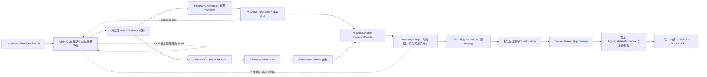

# analysis 当前实现架构

本文档以 [`REWRITE_DESIGN.md`](./REWRITE_DESIGN.md) 为业务语义来源，记录根 Cargo workspace
中 `analysis/` package `analysis` 的当前代码结构、内存数据模型和执行
流水线。其库名为 `analysis`，运行二进制为 `analysis`；同一
workspace 中的 `top_contract_analysis_rs` 是保留的旧实现，二者不是同一个 package。

重写采用实验级实现：四链快照一次装入内存，查重、候选归并、网络证据和深入分析都在
单进程中完成。这里的“实验级、简单”只表示不实现外存、断点恢复、分布式执行和近似
算法，不表示使用全表两两穷举。查重热路径参考 `dedup/crates/core` 的常驻 CSR postings、
无损候选边界、批量相似度比较和 worker scratch 复用，并针对“仅查询 100 个 seed”改造成
query-to-index 模式，避免构造全局对象对。

现有 `top_contract_analysis_rs` 只用于参考 API 字段解析、地址与生命周期分析、行为识别和
报告统计方法；新的查重与任务编排不复用其 DuckDB、旧候选召回、综合评分、置信分层或
批处理恢复路径。

## 1. 架构目标

程序必须完成以下固定工作：

1. 读取并按 `seed_top` 校验 Base、Ethereum、Polygon、Solana 各链 seed 数量；默认各 25 个、共 100 个；
2. 将四链完整 NFT 快照构造成全内存只读数据集；
3. 对每个 seed 执行四个候选链作用域和四个查重维度；
4. 对命中的 NFT、合约或 collection 获取网络证据；
5. 执行地址、传播、行为、攻击成本、攻击产出和诚实损失分析；
6. 输出单 seed、候选对象、链内、`4 × 4` 链矩阵、跨链和四链总报告。

目标设备与业务设计一致：

- Linux；
- 128 vCPU；
- 512 GiB RAM。

设计重点是：

- 所有查重基础数据在计算开始前进入内存，计算阶段不再读取 Parquet；
- Name、URI、Metadata 使用 seed 投影的只读连续索引；当前维度完成后立即释放，内存预检
  通过时允许下一维度准备工作利用当前维度的查询尾部；
- CPU 密集计算使用固定的 128 worker，网络请求使用独立异步运行时；
- 某个候选等待网络时，CPU 可以继续查重其他 seed；候选匹配、最终网络计划与legit标签
  冻结后，深入分析可与仍在运行的其他 shard 重叠；
- CPU 不能无界地产生网络任务，所有阶段之间使用有界队列；
- 同一候选被多个 seed 命中时，只获取一次网络证据、只执行一次候选级深入分析；
- 每个候选合约或 collection 只执行一次 serde+zstd 流式序列化，压缩结果经 staging 文件
  原子落盘并立即释放候选内存；全部 artifact 与报告完成后执行一次 run 级 durability
  屏障，随后才允许生成成功标记；
- 所有结果保持稳定顺序和可复现统计。

全流程采用“时间优先、同时及时释放无收益内存”的原则：

- 在配置与平台共同确定的进程内存边界内，优先减少墙钟时间；
- 不为了降低 RSS 引入磁盘 spill、重新读取 Parquet、重复解析或重复计算；
- 可复用且生成代价高的紧凑特征允许常驻到其最后一次读取；
- 已完成维度、候选图、原始响应、未压缩报告和写入 payload 在最后一次使用后立即释放；
- 当前索引与下一维度构建 scratch 可以短时共存，但必须在启动前纳入峰值预检；
- 任何并行重叠若只增加内存带宽竞争而不能缩短墙钟时间，应关闭该重叠而不是减少查重范围。

贯穿全流程的性能约束为：

- Parquet 使用两次列投影扫描：第一遍构建逻辑 NFT/合约基础列，第二遍只附加 Metadata；
  相同逻辑 Metadata 不重复规范化或向量化；
- Name、URI、Metadata 字节只全局存储一次，并在对应维度完成后释放不再使用的列；
- 每个唯一 Name、Metadata 文档和 Metadata profile 只准备一次；
- URI 只查询 `PreparedUriPlan` 中存在 posting 的 shard；Name 和 Metadata 的 probe 分别按
  seed 预处理一次并复用于所有 owner shard；命中再按四链分类；
- 候选边生成边去重、边评分，不物化全局对象对；
- 相同 provider 请求、交易详情、价格和候选分析只执行一次；
- 地址图、强连通分量和价值流只构建一次，供多个统计复用；
- 阶段之间传 ID 和范围，不复制大对象；
- 大对象只允许存在于一个明确 owner 中，完成最后一次计算或写入后立即 `drop`；
- URI 维度完成后销毁全量 NFT 身份和 TokenIdPool，只保留 seed 与真实 URI 命中的键；
- 候选局部地址、NFT 和交易 ID 在 owned candidate 数据释放前转换为跨合约稳定身份。

## 2. 简化边界

本重写明确不实现：

- DuckDB、PostgreSQL 或其他分析数据库；
- 文件映射数据集、磁盘 spill、外排、外存 postings、冷热分层或独立候选 arena；
- checkpoint、阶段恢复、运行缓存或跨运行复用；
- MinHash、LSH、模板召回、近似最近邻或候选配额；
- 跨 NUMA 节点迁移正在运行的大任务、复杂资源租约或无边界自适应并发控制；
- 多进程、分布式 worker 或远程任务队列；
- 旧代码中的候选过滤、综合分数和三层置信策略。

允许且要求使用不会减少命中集合的精确优化，包括：

- 字节完全相等快速路径；
- Jaro-Winkler 可证明安全的长度、前缀和字符重叠边界；
- BM25 正阈值下的零公共词排除和安全前缀 postings；
- 连续 CSR postings、并行 radix sort、字典编码和重复文档归并；
- 查询内候选去重、批量评分和线程本地 scratch 复用。

任何优化都必须与小数据穷举结果完全一致。内存不足时不能退化为近似结果。

进程异常退出后，从头重新运行。若完整数据和运行期结果无法放入内存，程序应在预检或
达到内存硬边界时明确失败，不切换到另一套策略，也不静默丢弃候选。

## 3. 包与模块结构

当前重写是根 workspace 的独立 Rust package，只在 package 内按职责拆分模块：

```text
analysis/
├── Cargo.toml
├── config/
│   └── default.toml
├── src/
│   ├── main.rs
│   ├── cli.rs
│   ├── config.rs
│   ├── error.rs
│   ├── platform.rs
│   ├── model/
│   │   ├── mod.rs
│   │   ├── identity.rs
│   │   ├── snapshot.rs
│   │   ├── matching.rs
│   │   ├── evidence.rs
│   │   └── report.rs
│   ├── seed/
│   │   ├── mod.rs
│   │   ├── selector.rs
│   │   └── manifest.rs
│   ├── input/
│   │   ├── mod.rs
│   │   ├── parquet.rs
│   │   └── validate.rs
│   ├── resident/
│   │   ├── mod.rs
│   │   ├── builder.rs
│   │   ├── store.rs
│   │   ├── value_pools.rs
│   │   ├── radix.rs
│   │   ├── query_plan.rs
│   │   ├── analysis_identity.rs
│   │   ├── name_index.rs
│   │   ├── uri_index.rs
│   │   └── metadata_index.rs
│   ├── dedup/
│   │   ├── mod.rs
│   │   ├── name.rs
│   │   ├── uri.rs
│   │   ├── metadata.rs
│   │   ├── scratch.rs
│   │   └── reducer.rs
│   ├── pipeline/
│   │   ├── mod.rs
│   │   ├── cpu_executor.rs
│   │   ├── scheduler.rs
│   │   ├── messages.rs
│   │   ├── candidate_registry.rs
│   │   ├── shard_seal.rs
│   │   └── coordinator.rs
│   ├── api/
│   │   ├── mod.rs
│   │   ├── evm.rs
│   │   ├── solana.rs
│   │   ├── market.rs
│   │   └── price.rs
│   ├── enrich/
│   │   ├── mod.rs
│   │   ├── plan.rs
│   │   ├── request_planner.rs
│   │   └── fetch.rs
│   ├── analysis/
│   │   ├── mod.rs
│   │   ├── attribution.rs
│   │   ├── lifecycle.rs
│   │   ├── propagation.rs
│   │   ├── behavior.rs
│   │   ├── economics.rs
│   │   ├── legit_duplicate.rs
│   │   ├── relation_projector.rs
│   │   └── quality.rs
│   ├── reporting/
│   │   ├── mod.rs
│   │   ├── aggregate.rs
│   │   ├── contract_writer.rs
│   │   ├── artifact_index.rs
│   │   ├── json.rs
│   │   ├── csv.rs
│   │   └── markdown.rs
│   └── progress.rs
└── tests/
    ├── four_chain_oracle.rs
    ├── pipeline_overlap.rs
    ├── api_fixtures.rs
    └── report_golden.rs
```

模块约束：

- `model` 只定义稳定数据类型，不执行 I/O；
- `platform` 只读取 Linux cpuset、cgroup 内存和 NUMA 拓扑并执行 `numa_mode`：多节点
  配置 node-local pool 与 first-touch，单节点或拓扑不可用时配置单一 128-worker pool；
  不参与业务判定；
- `resident` 只负责基础数据、seed 查询计划和当前维度索引，不解释报告口径；
- `dedup` 只实现 `REWRITE_DESIGN.md` 中的四维直接判定和与穷举等价的无损候选缩减；
- `api` 只负责请求和 provider 响应转换；
- `analysis` 只读取规范化证据，不直接发起网络请求；
- `reporting` 统一负责逐合约持久化、作用域、去重键、分子、分母和数据质量；
- `pipeline` 只负责任务状态、并发、背压和阶段连接。

## 4. 命令与配置

程序只提供两个业务命令：

```text
analysis select-seeds --config config/default.toml
analysis run --config config/default.toml --seeds seeds.json
```

`select-seeds` 统一使用 30 天窗口。Base、Ethereum、Polygon 使用 OpenSea
`sort_by=thirty_days_volume`，并以 collection stats 中 `interval=thirty_day` 的 `volume`
作为清单排名值，记录 `thirty_days_volume/30d`。由于 OpenSea 不再支持 Solana，Solana
回退到 Magic Eden `popular_collections?timeRange=30d`，直接保持其热门集合返回顺序并记录
`popularity_rank/30d`，最后由 Helius DAS 将样本 mint 解析为 collection 地址；`source` 为
实际供应商。命令按
`seed_top` 为各链独立配置的数量写出 seed 及其来源、指标、窗口和采集时间；默认仍为每链
`25`。`run` 只接受与当前
`seed_top` 数量一致的固定 seed manifest，不在运行过程中重新排名。

配置保留必要参数：

```text
snapshot_files
seed_manifest
output_dir
memory_limit
cpu_workers
index_shards
seed_batch_size
seed_top.{base,ethereum,polygon,solana}
numa_mode
tokio_worker_threads
cpu_queue_capacity
network_queue_capacity
analysis_queue_capacity
compression_concurrency
writer_threads
writer_queue_bytes
next_dimension_overlap
provider_timeout
provider_concurrency
provider_page_limits
provider_retry_count
name_threshold
metadata_threshold
metadata_anchor_count
analysis_timestamp
```

目标机固定：

```text
cpu_workers = 128
index_shards = 128
numa_mode = auto
```

这些值是目标机固定配置。cpuset 少于 128 个 CPU 时直接失败；`numa_mode = auto` 在多
NUMA 节点使用 node-local pool 和 first-touch，单节点或拓扑不可用时使用一个 128-worker
pool，不因 NUMA 拓扑差异失败。

默认业务值来自设计文档：

- `name_threshold = 0.98`；
- `metadata_threshold = 0.6`；
- `metadata_anchor_count = 8`；
- Wash Trading 最小节点数为 `2`；
- Layered Transfer 最小地址数为 `3`；
- 星型行为 fan-out 阈值为 `3`；
- 集中度比例为 `10%`。

任何覆盖值都写入 `run_manifest.json`。输入文件必须显式排序，不能依赖目录枚举顺序。

## 5. 全内存数据模型

### 5.1 全量常驻的含义

程序完整读取四链 Parquet，并在查重开始前构造不可变 `ResidentBaseStore`。每个逻辑 NFT
的身份及设计文档要求的 Name、URI、Metadata 状态都进入全内存构建过程；后续阶段不重新
打开 Parquet，也不查询本地数据库。三个维度索引不属于永久基础存储，而是按
URI → Name → Metadata 的顺序构建、查询和释放。

“全量常驻”指当前阶段的完整工作集只在内存计算，不要求同时保留 Arrow `RecordBatch`、
原始字符串和相同内容的多份 Rust `String`，也不要求已完成阶段的数据继续占用内存。
加载阶段把输入压缩为类型化 ID、连续字节池和定长记录，完成归并后立即释放解码批次及
构建临时表。设计规则已经归约掉的信息不重复保留。

Metadata 对每个合约或 collection 只保留设计文档规定的最多 8 个有效 anchor 的规范化
内容；空值、无效 JSON、非 anchor 和超过 64 KiB 的记录只保留明确质量计数。该压缩不
改变任何 Metadata 判定，因为后续算法不会读取这些记录。

### 5.2 身份类型

```text
ChainId       = { Base, Ethereum, Polygon, Solana }
ContractId    = u32
NftId         = u32
TokenIdId     = u32
MatchedNftKeyId = u32
NameValueId   = u32
UriValueId    = u32
MetadataId    = u32
ProfileId     = u32
TermId        = u32
GlobalAddressId = u32
GlobalTxId      = u32
GlobalNftId     = u32
SeedId        = u16
SourceOrder   = (file_ordinal: u16, file_row_number: u64)
```

启动时校验实际对象数没有超过 ID 类型容量。业务身份始终使用：

```text
ContractKey = (chain, contract_address)
NftKey      = (chain, contract_address, token_id)
```

整数 ID 只是进程内句柄，不进入外部报告替代真实对象键。

### 5.3 核心结构

```text
ResidentBaseStore
├── contracts: ContractCatalog
├── uri_identity: Option<UriNftIdentityStore>
├── uri_features: Option<UriFeatureStore>
├── name_features: Option<NameFeatureStore>
└── metadata_features: Option<MetadataFeatureStore>

ContractCatalog
└── contracts: Vec<ContractRecord {
        chain,
        address,
        nft_count,
        name_owner_shard: Option<u8>,
        metadata_owner_shard: Option<u8>
    }>

UriNftIdentityStore
├── token_id_pool: TokenIdPool
└── nfts: Vec<NftIdentityRecord { contract_id, token_id_id }>

MatchedNftKeyPool
└── 仅 seed 与真实 URI 命中的 NftKey

AnalysisIdentityStore
├── addresses: (chain, address) -> GlobalAddressId
├── transactions: (chain, tx_id) -> GlobalTxId
└── nfts: NftKey -> GlobalNftId
```

Name、URI、token id、Metadata、term 和分析身份使用不同 ID 域与连续池：

```text
TokenIdId
MatchedNftKeyId
NameValueId
UriValueId
MetadataId
TermId
GlobalAddressId
GlobalTxId
GlobalNftId
```

相同类型的相同字节只保存一份。哈希只用于定位，发生哈希碰撞时必须比较真实字节。
Metadata 使用独立连续 blob 池，避免大量小对象。类型化池保证 URI offsets 只按
`UriValueId` 分配，不被大量唯一 token id 扩大。

构建完成后按 `ContractId` 重排 NFT。URI 查询完成后，先把 seed 与真实命中的 token 键
复制到 `MatchedNftKeyPool`，再整体释放 `UriNftIdentityStore`、TokenIdPool、UriIndex 和
UriFeatureStore。Name、Metadata 和报告只读取 `ContractCatalog.nft_count`，不依赖全量
NftId 或 token id。

NameValueId 与 ProfileId 稳定后立即把对应 owner shard 写入 `ContractRecord`。晚发现候选
只读取这两个字段，不引用已释放的 Name/Metadata feature store。

`UriFeatureStore` 保存逐 NFT 的两个 UriValueId；`NameFeatureStore` 保存合约代表
NameValueId；`MetadataFeatureStore` 保存合约 profile、anchors、文档和向量。各维命中
证据复制为紧凑 `MatchEvidence` 后，对应 feature store 与索引一起释放：

```text
URI 查询完成      -> copy matched NftKey -> drop(UriIndex, UriFeatureStore, UriNftIdentityStore)
Name 查询完成     -> drop(NameIndex)     -> drop(NameFeatureStore)
Metadata 查询完成 -> drop(MetadataIndex) -> drop(MetadataFeatureStore)
```

释放前生成自包含 `MatchEvidence`：

- Name 保存双方代表 Name 字节、相似度和阈值；
- URI 保存命中的规范化 URI 字节和 NFT 键；
- Metadata 保存双方选中 token、规范化内容 digest、相似度和阈值；需要进入审计输出的
  内容由 candidate artifact 的 owned relation 自包含保存。

MatchEvidence 不允许引用即将释放的 NameValuePool、UriValuePool、MetadataPool 或索引
offset。

逐 NFT 的 `name_norm`、Metadata 原始状态和 `SourceOrder` 只在构建代表 Name、anchors
和质量计数时需要。这是等价的列裁剪，不删除任何后续判定或报告会读取的信息。

命中 NFT 集合使用：

```text
NftSelection =
    AllInContract { contract_id, nft_count }
  | Explicit(sorted MatchedNftKeyId)
```

Name 或 Metadata 命中写 `AllInContract`，URI 命中写 `Explicit`。只要任一维度为
`AllInContract`，四维并集仍用 `contract_id + nft_count` 表示，不展开 NftId。

### 5.4 Seed 查询计划

查询计划分两层，禁止在全局频率尚未确定时生成安全前缀：

```text
SeedRawPlan
├── missing_seed_ids
├── seed_name_values
├── seed_token_uri_values
├── seed_image_uri_values
├── seed_metadata_digests
├── seed_metadata_terms
└── seed_anchor_tokens

PreparedUriPlan
└── per_seed_non_empty_shards[token/image posting refs]

PreparedNamePlan
└── per_seed PreparedNameQuery[selected safe prefix or direct verification]

PreparedMetadataPlan
└── per_seed PreparedMetadataQuery[exact digests and lossless BM25 probes]
```

准备顺序：

1. URI 从连续 postings 目录生成只含非空 shard 的 `PreparedUriPlan`；
2. Name 扫描候选代表 Name，统计 seed token 的全局频率并暂存其 postings，再选择安全
   前缀并释放未入选 postings；
3. Metadata 扫描候选 profile，统计 seed term 的 profile-context 频率、文档范数摘要和
   seed-term 交集，再选择安全前缀；
4. 最终索引只保留 seed 前缀、digest、anchor token 和 term 所需 postings；无法证明可
   排除的 NameValueId/ProfileId 按正常 owner 函数进入各 shard 的直接验证尾区。

候选文档中不属于任何 seed 的 term 不参与点积，但必须计入候选范数。该压缩及所有安全
前缀均须与完整向量穷举 oracle 等价。

### 5.5 索引公共布局

所有大索引采用只读连续数组，不在查询热路径遍历嵌套 HashMap：

```text
CSR
├── offsets: Vec<u64>
└── postings: Vec<u32>
```

构建期可以使用分片 HashMap 做字典和计数，随后以并行 radix sort 生成稳定 ID、offsets
和 postings，并释放构建表。索引固定为 128 个 owner shard：Name 使用 NameValueId，
URI 使用 NftId，Metadata 使用 ProfileId，经稳定混合函数映射 shard。每个候选只属于一个
shard；索引同时保存 ChainId，一次查询即可把命中归入四个目标链。

相同代表 Name、相同 Metadata 文档和相同 Metadata profile 只计算一次，再通过成员
postings 展开到合约或 collection。外部报告始终展开为真实对象键。

### 5.6 NameIndex

`NameIndex` 参考 `dedup/crates/core/src/name` 的 resident candidate index，但四条链都使用
统一的合约或 collection 代表 Name：

```text
NameIndex
├── unique_names
├── utf32_character_pool
├── seed_token_pool
├── seed_token_frequency
├── shards[index_shards]
│   ├── token_to_name_offsets
│   └── token_to_name_postings
└── name_to_contract_postings
```

构建步骤：

1. 把相同代表 Name 归为一个 `NameValueId`；
2. 每个唯一 Name 只做一次 Unicode 字符解码和候选 token 提取；
3. 全库只统计 seed token 的候选频率并暂存对应 postings；
4. 按全局稀有度和 `0.98` 安全上界计算 100 个 seed 的查询前缀；
5. 释放未进入任何安全前缀的临时 postings；
6. 建立 `NameValueId` 到 ContractId 的成员 postings。

查询先处理完全相等组，再探测安全前缀 postings。候选使用长度、字符重叠等可证明安全的
边界过滤，最后以 RapidFuzz `BatchComparator` 执行 Jaro-Winkler。索引只能漏掉被证明
不可能达到阈值的对象。无法形成可证明安全前缀的极短或特殊 Name 进入很小的
`unindexable_names` 尾区；每个 NameValueId 仍按 `stable_mix(NameValueId) & 127` 分片，
由对应 shard 的 seed batch 直接验证。

### 5.7 UriIndex

URI 先由 `UriValuePool` 归并相同真实字节，再建立：

```text
UriIndex
├── seed_uri_values
├── token_uri_offsets
├── token_uri_postings: [NftId]
├── image_uri_offsets
└── image_uri_postings: [NftId]
```

索引只包含 100 个 seed 实际使用的 URI。postings 内按链、合约、NFT 排序。查询一个 URI
是一次 offset 定位和连续范围扫描，不做字符串哈希查询和对象分配。token URI 命中先写入
范围内 bitset，image URI 查询用该 bitset 跳过同一作用域已经命中的 NFT。

### 5.8 MetadataIndex

`MetadataIndex` 参考 `dedup/crates/core/src/metadata/direct.rs` 的常驻无损候选索引，并按
本文设计的四链统一 anchor 对齐规则改造：

```text
MetadataIndex
├── canonical_documents
├── exact_digest_postings
├── seed_term_dictionary
├── seed_term_intersections
├── document_frequency_histograms
├── document_norm_summaries
├── contract_profiles
├── profile_members
└── shards[index_shards]
    ├── max_document_term_postings
    └── token_anchor_term_postings
```

优化层次：

1. 相同规范化 JSON 归为一个 `DocumentId`，digest 命中后仍比较真实字节；
2. 相同 anchor token 与 `DocumentId` 序列归为一个 `ProfileId`；
3. 每个文档只分词一次，保留范数摘要及其与 seed term 的交集；
4. 无共同 token 的比较只为 seed 最大 anchor 的 term 建候选 postings；
5. 存在共同 token 的比较只为 seed 的 `(anchor_token, term)` 建候选 postings；
6. 正阈值下没有公共 term 的文档余弦为零，可安全排除；
7. 候选生成后重新执行“最大共同 anchor，否则双方最大 anchor”的真实选择规则；
8. 非 seed term 只贡献候选范数，不进入 postings；
9. 最后比较完整规范化字节或执行与完整 term vector 等价的 BM25 加权余弦。

安全前缀长度由阈值和文档向量上界计算。候选以 query 为单位边生成、边去重、边评分，
不生成全局 profile-pair 文件或全局候选对集合。没有 term 的可用文档仍进入 exact
postings，保证完全相同的低内容文档不会被漏掉。某个文档若无法形成安全 BM25 前缀，
则该文档所在 ProfileId 按正常 owner 函数进入对应 shard 的直接验证尾区。

只出现在一个 profile 的 anchor token 无法形成共同 token，不建立
`token_anchor_term_postings`；只关联一个候选 profile 的 term 不能连接两个 profile，
也不建立候选 posting。两类省略都通过 profile 频次证明无损。

## 6. 加载与索引构建

`run` 只在 `ResidentBaseStore` 与 `SeedRawPlan` 完成前设置启动屏障。URI、Name、
Metadata 保持业务顺序；下一维度准备可在当前查询尾部使用空闲 worker，条件是峰值预检
覆盖两个工作集。


加载方法保持直接：

1. 按配置中的文件顺序给每行分配稳定 `SourceOrder`；
2. Rayon 并行解码 row group，投影设计文档规定的字段；
3. 解码批次通过有界队列进入按逻辑主键哈希分片的 builder，避免单个全局锁；
4. 每个 builder 维护线程本地字典、代表 Name 计数和有界 Metadata anchor 集；
5. builder 按逻辑主键归并重复行并记录冲突；
6. 完成全部输入后用并行 radix sort 合并分片，生成稳定 ContractId、NftId 和连续范围；
7. 统计代表 Name，选择前 8 个有效 Metadata anchors，生成稳定 NameValueId/ProfileId，
   并把两个 owner shard 写入 ContractCatalog；
8. 释放 Arrow 批次、局部字典、计数表和排序临时空间，冻结基础存储；
9. 定位清单中的 seed 并生成 `SeedRawPlan`；不在 snapshot 中的 seed 进入
   `missing_seed_ids`，不生成维度查询且不终止运行；
10. URI 查询完成后复制命中 NftKey，并整体释放 URI NFT 身份与特征；
11. URI 生成只含非空 posting shard 的 `PreparedUriPlan`；Name、Metadata 完成当前维度
    全局统计后分别生成 `PreparedNamePlan` 与 `PreparedMetadataPlan`，每个 seed 的 probe
    只准备一次；
12. URI 与 Name 的 seed batch 使用维度级 `ShardWorkTracker` 记录失败 bitmap；Metadata
    以 owner shard 独立累计 exact/BM25 batch，不建立全 seed 完成屏障；
13. Metadata 先执行 exact wave 并发布预取提示，再执行 BM25 wave；某 owner shard 的
    BM25 batch 全部返回后立即合并并发布该 shard 的冻结候选；
14. 当前维度证据自包含后释放索引和 feature store；
15. 任一命中可启动有界网络预取；收到 owner-shard 冻结关系后，以 move-only
    `CandidateRecord` 复用或补齐证据，随后直接进入分析；
16. 最后一个维度完成后只封闭尚未提前封闭的关系。

尾部重叠只提交下一维度准备任务，不让两个全库扫描同时占满 128 worker。当前维度可运行
任务不足、下一维度内存 permit 已取得时才允许重叠；任一条件不满足即保持串行。

加载和索引构建避免以下低效行为：

- 不为每行创建长期存活的 `String`、`serde_json::Value` 或 HashMap；
- 不把所有 decoded row 收集到一个全局 `Vec<InputRow>` 后再串行归并；
- 不对同一 Metadata 文档重复解析、规范化或分词；
- 不使用比较排序构建数亿级 postings；
- 不在多个索引中复制真实 URI、Name 或 Metadata 字节；
- 不为 100 个 seed 永远不会查询的值建立 postings；
- 不同时保留三个维度的构建 scratch 和最终索引；
- 不让 row-group 解码队列超过配置字节上限。

任何字段冲突、未知链、seed 缺失或输入不完整都在启动屏障内失败。业务查重不会读取一个
半完成的 `ResidentBaseStore`。

## 7. 四维查重执行

### 7.1 工作单元

查重的可调度根任务是 seed batch 或已经预备好的非空 URI shard：

```text
DimensionShardSeedBatch = (dimension, shard_id, seed_range)
PreparedUriShardQuery   = (seed_id, shard_id, token_posting_refs, image_posting_refs)
```

URI 的一个 shard query 同时执行 token URI 和 image URI 优先级。Name 与 Metadata 按
`seed_batch_size` 处理，使热 shard 可被其他 worker 继续消费；Metadata 的 exact/BM25
completion 同时携带 owner shard，coordinator 可独立完成该 shard。

候选按 `stable_mix(owner_id) & 127` 归属唯一 shard；owner_id 分别为 NameValueId、
NftId 或 ProfileId。一个候选的全部 token postings 都写入同一 shard，因此同一 seed 下
只会被一个 shard worker 去重和评分一次。禁止按原始 posting range 任意切分后让多个
worker 独立评分。成员展开在当前 query 闭包内同步完成，不再注册第二套子任务或证据计数。

URI 与 Name 各维护一个维度级 tracker：

```text
ShardWorkTracker {
    producer_closed,
    seed_batches_inflight,
    failed_seed_bitmap[100]
}
```

每个根任务在提交前登记 `seed_batches_inflight`，闭包内同步完成候选生成、验证、证据写入和
局部 reducer；RAII guard 在成功时正常完成，在 panic 时标记精确 seed bitmap 并减少计数。
全部根任务已登记后关闭 producer。没有异步后代，因此 seal 不需要模拟成员或 evidence 的
第二套生命周期。

唯一终态转换由 coordinator 对以下谓词执行一次 CAS：

```text
quiescent =
    producer_closed
    AND seed_batches_inflight == 0

quiescent -> DimensionShardSeal { failed_seed_bitmap }
```

URI/Name 可归因的 query panic 通过 bitmap 将对应 seed 标记 incomplete。Metadata 使用不同
失败边界：任一 exact/BM25 batch、completion channel、coordinator、reducer 或共享索引失败
都直接终止整个 run，不发布部分 Metadata 结果。

### 7.2 Name 查询

每个 seed 的代表 Name 在每个候选 shard 查询一次：

1. 定位完全相同的 `NameValueId` 并展开其成员；
2. 计算满足阈值所需的安全 token 前缀；
3. 顺序读取这些 token 的 CSR postings；
4. 用 shard-local generation marks 去重 `NameValueId`；
5. 应用安全长度和字符重叠边界；
6. 从 `PreparedNamePlan` 取得预处理 Name，并为当前 worker 构造 RapidFuzz
   `BatchComparator`；
7. 批量评分剩余唯一 Name；
8. 达到 `0.98` 后展开 `name_to_contract_postings`，按链写入命中。

候选生成、去重、边界过滤和评分在一个 shard worker 流水中完成，不把全局 Name 候选
集合物化。相同候选 Name 无论属于多少合约都只评分一次。

### 7.3 URI 查询

索引构建时，各 NUMA lane 只扫描互不重叠的 feature 连续区间。临时分片表在 `finalize()`
后扁平化为 token/image 两条连续 postings 数组，以及
`UriValueId -> [UriPostingRef { shard, range }]` 的非空 shard 目录；构建表随即释放。

每个 seed 先把非空 URI 转换为去重后的 `UriValueId`。`PreparedUriPlan` 一次查目录，只为
实际存在 posting 的 shard 生成 query；运行时不再固定执行 `100 × 128` 个空探测。每个
prepared shard 同时执行：

1. 批量读取所有 token URI posting ranges；
2. 排除 seed 自身并按四链记录实际命中 NftId；
3. 建立本 seed、当前 shard 内的 token-hit bitmap；
4. 批量读取 image URI posting ranges；
5. 跳过相同作用域中已由 token URI 命中的 NFT；
6. 输出 URI 字节证据和真实 NFT 键。

URI 查询只扫描准备好的连续 ranges，不重复 hash probe，也不对每条 posting 重新比较字符串。

### 7.4 Metadata 查询

Metadata 在进入 shard 查询前构造 `PreparedMetadataPlan`：每个 seed 的 exact digest 和无损
BM25 posting probes 只按全局 rarity 准备一次，并由全部 owner shard 复用。查询分两波：

1. exact wave：digest postings 召回完全相同文档并比较真实规范化字节；命中立即登记
   `WholeCollection`；
2. BM25 wave：按 seed profile 的最大 anchor 和各 anchor token 探测安全前缀 postings；
3. 用 shard-local generation marks 对候选 `ProfileId` 去重；
4. 重新执行最大共同 anchor 选择；
5. 以 seed-term 交集合并扫描确认公共 term，并用文档范数摘要计算完整 BM25 余弦；
6. 达到 `0.6` 后展开 profile 成员；
7. coordinator 为每个 owner shard 维护剩余 BM25 batch 计数；计数归零时立即合并该 shard
   的 base、exact 和 BM25 关系并发布 Frozen 批次，不等待其他 owner shard 或所有 seed；
8. 任一 Metadata batch 失败时终止整个 run，已经准备的部分关系不得伪装为完整 seal。

候选前缀只排除在乐观上界下仍不可能达到阈值的 profile。无法证明时必须进入最终评分。
相同 Metadata 文档和相同 profile 不重复解析、向量化或评分。

### 7.5 WorkerScratch

每个 CPU worker 复用一个 `WorkerScratch`：

```text
name_generation_marks
metadata_generation_marks
candidate_ids
score_buffer
uri_hit_bitmap
bm25_merge_buffer
graph_visit_marks
```

generation marks 只按当前 shard 的候选容量分配，并通过递增代数逻辑清空，避免每个
query 初始化全局数千万槽位。candidate 和 score buffer 保留容量供下一任务复用；异常大
的临时 buffer 在任务结束后收缩到配置上限。热路径不为每个候选创建 HashSet、String、
JSON 对象或小 Vec。

### 7.6 归并

`dedup::reducer` 按以下层次归并：

1. URI/Name 的 worker 局部结果先归并为维度结果；Metadata 按 owner shard 独立归并；
2. 一次 dimension 归并按候选 ChainId 形成四个链作用域；
3. Name、`token_uri`、`image_uri`、Metadata 分别保留证据；
4. 同一作用域内按完整对象键去重；
5. 四维结果取 NFT 集合并集；
6. URI/Name 全部根 query 完成后各发布一次携带 `failed_seed_bitmap` 的维度 seal；
7. Metadata owner shard 的最后一个 BM25 batch 完成后，立即冻结该 shard 唯一能够产生的
   seed–candidate 关系；不存在等待所有 seed/全部 Metadata shard 的二次屏障；
8. URI/Name 失败 bitmap 中的 seed 关系标记 incomplete；Metadata 失败按 §7.1 终止 run；
9. seed 自身、合法重复和疑似重复保持不同状态，不互相覆盖。

归并结果以 `(seed_id, candidate_contract_id)` 为主记录，维度使用 bitmask，NFT 使用
`NftSelection`，相似度和字节证据使用引用。不会为四种报告作用域复制同一关系。

一个 dimension 查询覆盖四个候选链。URI/Name 可归因 query 失败时，该 seed 不进入正式
完成分母，已获得证据仍写入失败审计；Metadata 不能安全发布部分 owner 结果，因此失败时
整 run 失败。

## 8. CPU 与网络 I/O 流水线

### 8.1 总体流水线

加载屏障完成后，查重、网络采集和深入分析跨不同 seed、不同候选重叠执行：



网络证据与查重始终可重叠；某个 Metadata owner shard seal 后，其冻结候选可直接复用预取
结果或补齐证据并进入分析。其他 Metadata shard 仍可继续运行，全局维度结束不再是候选
分析屏障。

### 8.2 三个执行域

程序建立三个执行域：

- 一个总计 128 worker 的 `CpuExecutor`：负责 Parquet 解码、索引构建、查重、响应解析、
  图算法、统计、序列化和压缩；
- 一个 Tokio runtime：只负责 HTTP 请求、超时、限速、重试和队列协调；
- 一个小型 ContractWriter pool：只负责本地磁盘写入、flush 和原子 rename。

目标设备的初始配置为：

```text
cpu_workers          = 128
index_shards         = 128
seed_batch_size      = 8
tokio_worker_threads = 4
cpu_queue_capacity   = 512
network_queue_capacity = 256
analysis_queue_capacity = 256
compression_concurrency = 8
writer_threads       = 8
writer_queue_bytes   = 2 GiB
next_dimension_overlap = true
```

128 个 CPU worker 是目标机固定配置。Tokio 线程主要等待 I/O，ContractWriter 线程只做
阻塞写入，不执行查重或图计算。所有重 CPU 工作只能进入 `CpuExecutor`。这些参数写入运行
清单，不在运行中自动减少 CPU worker 数。

Linux 启动时要求 cpuset 至少允许 128 个 CPU。`numa_mode = auto`：多节点建立
node-local Rayon pool，单节点或拓扑不可用时建立一个 pool；worker 总数始终为 128。
仅在多节点模式下，索引 shard 的构建、查询和 first-touch 固定在所属节点，候选按
ContractId 选择 home node，响应解码、候选分析和序列化路由到该节点；只迁移尚未开始执行
的 owned job。单 pool 模式不执行 node 绑定。

异步任务不得直接执行 JSON 大批量解析、Jaro-Winkler、BM25、图算法或报告聚合。CPU 工作
也不得阻塞等待 HTTP；两者通过有界任务队列和 typed completion 连接。

### 8.3 有界提交与公平性

调度器维护四个有界 ready queue：

1. 最多保持 `cpu_queue_capacity` 个待执行 CPU 任务；
2. `dedup-ready`、`response-decode-ready`、`analysis-ready`、`compress-ready` 使用
   work-conserving 加权轮转；
3. owner shard 未封闭时优先级为
   `dedup > decode > analysis > compress`；全部封闭后为
   `analysis > decode > compress`；
4. decode 有最低服务保证；任一队列为空时其份额立即借给其他队列；
5. 压缩仍在 128-worker executor 内执行，并受 `compression_concurrency` 限制；
6. query 只按候选所有权 shard 并行，不按 posting range 重复评分；
7. 所有 node-local pool 合计只包含 128 个 CPU worker，不创建嵌套 CPU 线程池；
8. NUMA 节点内允许 work stealing，不创建每 seed、请求或候选 OS 线程。

调度器的四条 ready queue 直接保存 job 闭包，不再使用 work ID 和 HashMap 二次查找。
查重任务共享只读 store；候选阶段通过 `CandidateRecord -> AnalyzedCandidate ->
PreparedCandidate -> ProcessedCandidate` 所有权移动大对象，避免快照复制和并行影子状态。

CPU 任务提交前取得 admission permit。fire-and-forget 查重任务由调用方自己的 completion
channel 回传结果；候选分析和压缩把完整 typed result 直接发送到非阻塞 unbounded
completion channel，不分配第二个 CompletionSlot。只有 Tokio coordinator 可以等待下游
队列容量，从结构上避免 CPU worker 被满队列阻塞。

### 8.4 候选所有权与去重

候选阶段不维护一份与真实任务并行的生命周期表。`CandidateRegistry` 只是按稠密
CandidateId 索引的 seen bitmap，用约 `contract_count / 8` 字节拒绝重复 Frozen 候选；它
不保存 relation payload、请求状态、分析状态或持久化状态。

真实工作由以下所有权移动表达：

```text
CandidateRecord { id, key, Arc<Vec<SeedCandidateRelation>> }
  -> network completion
  -> AnalyzedCandidate
  -> PreparedCandidate { disk-backed PreparedPayload }
  -> ProcessedCandidate { exact-byte permit }
  -> ArtifactRef
```

coordinator 用小型 active ID set 防止分析或压缩重复排队；typed completion 自带结果，完成
后从 active set 删除。发生错误时，错误随 owned record 进入失败 artifact 或直接使 run 失败，
不需要同步更新另一套枚举状态。

预取由单个 `PrefetchCoordinator` 管理，每个 CandidateId 只有一个
`Queued | Active { upgrade, frozen } | Complete` entry。Name/Metadata exact 或 URI 提示可提前
提交证据请求；新提示合并 relation 与 `NftSelection`。Frozen 批次到达后：

- 已完成且覆盖最终 selection/seed 集的预取直接复用；
- 已完成但缺少关系验证的证据只补关系验证；
- selection 从 Explicit 升级为 WholeCollection 时重新提交完整 fetch；
- 活跃预取把最终 CandidateRecord 暂存在同一 entry，完成后立即决定复用或补 fetch；
- 排队但尚未启动的过时预取被最终 fetch 取代。

Metadata 候选只可能由唯一 owner shard 产生。该 shard 的最后一个 BM25 batch 完成时已拥有
base、exact 和 BM25 的完整关系，因此立即发布 Frozen；不等待所有 seed 或其他 Metadata
shard。没有 Metadata owner 的候选使用已完成的 URI/Name base 关系直接发布。

同一候选最终只生成一次规范化 `EvidenceBundle` 和一次候选级深入分析。分页截断写入
EvidenceQuality，不会被误记为完整成功。

### 8.5 网络任务

`EvidenceProvider` 根据链、最终 `NftSelection` 和冻结 relations 获取候选级证据：

- EVM：部署、创建者、管理者、mint、transfer、sale、holder、资金流和市场证据；
- Solana：collection authority、mint、transfer、sale、holder、签名和交易证据；
- 通用：市场活动、手续费、原生资产价格和 USD 换算；
- 关系验证：seed/candidate 控制者或 authority 连续性、官方 collection 关系及可验证的
  迁移、bridge、burn/lock/mint 证据。

四链 sale、listing 等市场事件统一由 OpenSea 获取。Alchemy 与 Helius 仅提供链上证据；
Helius 历史中的市场标签在规范化后只保留对应链上 transfer，不能成为市场事件来源。

每个 provider client 自己维护连接池、限流 permit、分页与重试；pipeline 不构造一套未被
执行器消费的请求计划。初始并发：

```text
Alchemy = 16
Helius  = 4
其他 API = 4
```

请求使用固定超时和有限次数重试。分页达到配置边界时停止并标记 `truncated`；请求失败、
未请求、截断和真实空结果使用不同状态。进程内可复用同一候选的响应，但不写持久缓存。

每个 provider 全程复用一个 HTTP client、连接池和 TLS session。当前不维护通用的跨候选
请求合批表；价格按 `(native_asset, time_bucket)` 在进程内 single-flight 缓存，候选内部的
独立证据分支并发执行并复用已经取得的基础证据。

网络响应完成后，Tokio 只完成 body 收集和基本状态判断；较大的 JSON 解码与事件规范化
作为 CPU 任务提交到 Rayon。转换成紧凑、链无关的事件记录后立即丢弃原始 HTTP body；
规范化完成或明确失败后，结果作为一个 `EvidenceBundle` 返回候选 coordinator。深入分析
只读取该 bundle，不理解 provider 私有 JSON。

### 8.6 逐合约持久化与释放

候选级数据严格使用单一所有权，不进入永久 `EvidenceStore` 或 `AnalysisStore`：

```text
CandidateRecord + EvidenceBundle
  --move--> CandidateAnalysis --> AnalyzedCandidate

CandidateFacts + frozen RelationLabels
  --RelationProjector--> RelationDelta[]

{EvidenceBundle, CandidateFacts, RelationLabels, RelationDelta[]}
  --single serde+zstd--> .staging/PreparedPayload

RelationDelta[] + candidate_quality
  --move--> AggregateDelta --merge_once--> AggregateState

PreparedPayload --exact compressed-byte admission--> ReservedPayload
  --atomic rename--> ArtifactRef

all artifacts + final reports --one run-level durability barrier--> _SUCCESS
```

处理顺序：

1. 分析任务独占 `CandidateRecord` 与 `EvidenceBundle`，不复制完整事件数组；
2. 分析结束立即释放传播图、价值流图、排序数组和 worker scratch；
3. `RelationProjector` 把 CandidateFacts 投影为 RelationDelta，并将局部 ID 转成全局 ID；
4. serializer 只遍历 artifact 一次，JSON 直接流入 zstd level 1 encoder 和带 checksum 的
   staging 文件，不生成完整未压缩 JSON，也不先做 CountingWriter 预序列化；
5. 压缩完成后把 RelationDelta 和候选质量移动为最小 AggregateDelta，以 `merge_once`
   合并；随后释放 EvidenceBundle、CandidateFacts 和其临时数据；
6. `PreparedPayload` 以实际压缩字节尝试 writer admission；等待 admission 的 staging 文件
   数量与活跃压缩任务之和不超过 `compression_concurrency`，已 admission 字节总量不超过
   `writer_queue_bytes`；单文件超过上限时明确失败；
7. ContractWriter 将 staging 文件原子 rename 到目标路径，释放 byte permit，只保留带路径、
   checksum、压缩字节数和轻量摘要的 `ArtifactRef`；
8. 全部 artifact 和最终报告完成后，`finish_success()` 删除空 staging 目录，执行一次 run
   级文件系统 durability 屏障，再原子写 `_SUCCESS`。不执行逐候选或定时批量 sync。

每个候选合约或 collection 的目标文件为：

```text
result/<run_id>/contracts/<chain>/<address_prefix>/<contract_address>.json.zst
```

`run_id` 目录以独占创建方式生成且不复用；`address_prefix` 分散目录项。一个候选只写
一个文件。artifact 至少包含真实候选身份、MatchEvidence、冻结 RelationLabels、
CandidateFacts 派生指标、RelationDelta 和数据质量；分析失败时以错误记录替代缺失的分析
字段。所有引用必须在序列化前解析为真实对象键或 artifact 内自包含键。rename 或最终
durability 固定重试/执行后仍失败则整个运行失败。

### 8.7 背压

阶段间队列同时受条目数和批次字节上限约束。队列满时：

- 网络生产者暂停接收新的候选 ID；
- 查重归并仍可继续到常驻候选缓冲的预算边界；
- 达到边界后调度器暂停提交新的查重 shard query；
- 已压缩 payload 的实际字节达到 `writer_queue_bytes` 后暂停新的 writer admission；
- staging payload 数达到 `compression_concurrency` 时暂停新的压缩，避免磁盘临时文件无界；
- 已返回的网络任务、已排队的 CPU 分析和 ContractWriter 继续完成，以释放容量。

背压只暂停生产，不丢弃匹配、候选或证据。短时网络等待不会使 CPU 空闲；若网络长期慢于
CPU，受控暂停是防止任务和内存无界增长的唯一行为。

## 9. 深入分析结构

证据规范化完成后，`legit_duplicate` 为冻结 relations 生成 `RelationLabels`。
候选级公共事实不读取或修改关系分类，并按固定顺序执行：

1. 规范化事件和交易去重；
2. 地址证据归并与角色归因；
3. 构建传播图、价值流和生命周期；
4. 识别 Wash Trading 与 Pump-and-Exit；
5. 压缩强连通分量并识别 Sybil Distribution、Fraud Revenue、Poisoning；
6. 识别 Layered Transfer 与 Inventory Concentration；
7. 统计攻击者 Setup、Lure、Exit 成本和产出；
8. 统计诚实买家、损失、仍持有 NFT 和套牢时间；
9. 生成候选级数据质量和可复用 `CandidateFacts`。

这些任务可以参考现有代码中的：

- `analysis/address_records`；
- `analysis/lifecycle`；
- `analysis/paper_stats`；
- `analysis/propagation.rs`；
- `analysis/value_flow.rs`；
- `currency.rs`。

参考只用于保持统计含义。重写后的函数必须接受新的 `EvidenceBundle` 和显式配置，不能读取
旧 store、旧 cache 或旧全局状态。

### 9.1 生命周期与早期信号

每个候选输出：

- 部署、首次 mint、transfer、sale、受害时间及部署后的间隔；
- NFT、地址、事件边、mint、transfer、sale、资金流和收入统计；
- 首次结果时间：`min(first_sale_time, first_victim_time)` 中的有效值；
- 早期信号：部署时间有效、已观察到结果，且结果前至少出现两个不同信号类别。

信号类别固定为内容复制、控制/资金关联、协同 mint/分发、异常 listing/市场准备。按类别
去重，不按事件条数累计；sale、受害和付费 mint 结果本身不算早期信号。历史失败、截断或
时间缺失时输出 `unknown/incomplete`，不能写成阴性。

### 9.2 legit_duplicate

该步骤位于规范化证据与 relation projection 之间。判定单位为 `SeedCandidateRelation`，
输出：

```text
RelationLabel {
    seed_id,
    candidate_id,
    classification:
        SuspectedDuplicate { legit_verification: Complete | Incomplete }
      | LegitDuplicate { evidence }
}
```

`LegitDuplicate` 必须具有官方控制者或 authority 连续性、官方地址执行的授权重发、可验证
迁移/桥接交易、或 provider/链上字段证明的官方 collection 关系之一。仅 open license、
共同持有、部署时间、totalSupply、旧黑名单或弱地址共现不能判定合法。合法关系保留在查重
审计，但不进入侵权、恶意行为和诚实损失分子；证据缺失仍保留为疑似重复并标记验证不完整；
同一候选相对不同 seed 分别判定。

RelationLabel 随 owned `AnalyzedCandidate` 移动，证据键必须自包含，不得引用 provider 原始
响应或随后释放的 EvidenceBundle offset。

### 9.3 公共中间表示

图与统计只构建一次候选级中间表示：

1. 交易先按 `(chain, tx_id, event_index)` 排序和去重；
2. 地址、NFT 和交易映射为候选内局部连续 ID；生成 AggregateDelta 前转换为全局 ID；
3. mint、transfer、sale、funding、withdrawal、cashout 使用定长事件数组；
4. 传播图和价值流图构造成 CSR；
5. 强连通分量只计算一次，同时供 Wash Trading、Pump-and-Exit 和三类星型行为使用；
6. 地址角色、行为和经济统计共享同一事件索引，不各自重扫 provider 原始结果；
7. 金额和时间字段预先转换为统一定长表示。

统计分两层：

```text
CandidateAnalysis(EvidenceBundle)
  -> CandidateFacts

RelationProjector(CandidateFacts, frozen RelationLabels, NftSelection)
  -> RelationDelta[]

AggregateDelta {
    candidate_id,
    relation_deltas,
    candidate_quality
}
```

`RelationProjector` 是分析流水线中唯一读取 `RelationLabels` 的计算步骤。
同一候选相对 seed A 合法、seed B 可疑时，图、SCC、角色证据、行为实例和经济事实仍只计算
一次；A 的侵权、恶意行为和诚实损失分子排除该关系，B 按其 NftSelection 纳入。链内、
矩阵、跨链和 all_chains reducer 先按关系标签过滤，再按真实对象键取并集；同一作用域中
存在至少一个可疑关系时，候选只计一次。

候选分析结束后立即归还排序、图遍历和 worker scratch。证据、行为实例和聚合量只存活到
单次序列化完成；staging 文件原子 rename 后只保留 ArtifactRef 和已归并聚合。大图按事件数
估算成本并切为独立 CPU 任务。

## 10. 共享上下文与所有权

跨线程长期共享的只读或并发对象保持最少：

```text
Run-owned shared objects
├── provider: Arc<dyn EvidenceProvider>
├── executor: Arc<CpuExecutor>
├── analysis_identity: Arc<AnalysisIdentityStore>
└── resident/dimension stores: Arc only while worker tasks are active
```

单一 coordinator 独占可变控制面：

```text
CoordinatorState
├── CandidateRegistry: dense seen bitmap
├── PrefetchCoordinator: one entry map + order queue
├── final/network/analysis/compression/write queues
├── AggregateState
├── ArtifactIndex
└── ScopeRelation[]
```

原则：

- `ContractCatalog`、匹配键和全局分析身份只保留报告仍需的数据；
- URI 查询后整体释放全量 NFT 身份和 TokenIdPool；
- 各 feature store 从基础冻结存活到所属维度完成；同一时刻只有当前索引和获批的下一维度
  准备状态；
- 所有 shard query 的 completion 都收到后，coordinator 才 `take()` 并 drop 当前 index；
- MatchEvidence 完成自包含后，再 drop 当前 feature store；
- 当前维度完成后 drop 对应 `PreparedUriPlan`、`PreparedNamePlan` 或
  `PreparedMetadataPlan`；全部维度完成后 drop `SeedRawPlan`；
- EvidenceBundle、CandidateFacts 和 PreparedPayload 使用 move-only 所有权，不放入长期
  Arc store；immutable relations 在一个候选的预取/final record 间只共享同一 Arc payload；
- CPU completion 直接携带 typed owned result，不再维护 slot 或结果 side table；
- `AggregateState` 与 `ArtifactIndex` 由 coordinator 以普通可变字段拥有，不加伪共享锁；
- `AnalysisIdentityStore` 固定分为 256 个 stable-hash shard；每个候选先按 shard 批量整理
  唯一真实键，再按 shard 顺序各加锁一次完成 intern，禁止逐事件争用全局锁；
- reducer 在单个分片内拥有可变数据，完成后一次发布不可变结果；
- HashMap 只用于查找，输出前必须按固定链顺序和真实对象键排序。

## 11. 内存边界

目标数据已经验证能够装入 512 GiB。运行时仍预留 48 GiB 给 Linux、网络栈和不可预测
峰值；默认配置的进程预算上限为 464 GiB，但它不是启动门槛：

```text
available_memory = min(physical_memory, cgroup_memory_limit_or_physical)
effective_memory_limit = available_memory.saturating_sub(48 GiB)
process_memory_limit = min(config.memory_limit, effective_memory_limit)
```

程序不因平台内存低于默认 464 GiB 上限而拒绝启动，而是让加载预算、峰值计划和实际 RSS
检查使用 `process_memory_limit`。程序跟踪：

- `base_resident_bytes`：ContractCatalog、URI阶段身份和尚未完成维度的 feature stores；
- `dimension_bytes`：当前索引、下一维度准备及两者 scratch；
- `candidate_inflight_bytes`：网络证据、CandidateRecord、分析事实和完成结果；
- `writer_queue_bytes`：已经 admission 的 PreparedPayload 实际压缩字节，硬上限 2 GiB；
  未 admission staging 文件数量另受 `compression_concurrency` 限制；
- `aggregate_bytes`：轻量 ScopeRelation、全局分析身份、ArtifactIndex 和 AggregateState；
- `worker_scratch_bytes`：128 worker 的 shard-local 可复用 scratch。

候选数据由 owned Rust 容器随 move stage 转移；阶段结束即 drop。worker-local Name、URI、
Metadata scratch 在维度结束时通过每 Rayon worker 的 broadcast 清理，避免最大候选容量
永久留在线程本地缓存。

启动预检：

```text
peak =
  long_lived
  + current_dimension
  + enabled_next_dimension_overlap
  + 128_worker_scratch
  + candidate_inflight_limit
  + writer_queue_limit
  + allocator_reserve
```

`peak > process_memory_limit` 时先禁用下一维度重叠并重算；仍超限才启动失败，不 spill。

释放顺序是硬约束：

```text
row group merged          -> drop decoded batch
dimension index built     -> drop build counters and radix scratch
URI query completed       -> copy matched keys; drop NFT identities, TokenIdPool and URI features
dimension query completed -> drop index, then drop dimension feature store
dimension completed       -> broadcast-drop worker scratch and prepared plan
all dimensions completed  -> drop SeedRawPlan
candidate analyzed        -> drop graph and algorithm scratch
candidate serialized      -> drop EvidenceBundle and CandidateFacts; retain staging payload only
artifact atomic rename    -> release exact-byte permit; retain ArtifactRef only
final report completed    -> drop ScopeRelation, AggregateState and identity stores
```

worker generation marks 只按 index shard 容量分配。构建前计算 dense marks 的总字节；若超过
worker scratch 预算，使用与 `dedup` 一致的 Sparse seen，语义不变。索引查询不保留全局
Name/Metadata candidate-pair 集合，只保留最终 MatchEvidence。

加载屏障后做一次内存检查；候选流水线每 1 秒读取并缓存 cgroup v2 `memory.current`，无法
读取时回退 `/proc/self/statm`。事件循环使用缓存值做 admission，不再在每个 completion 上
执行同步文件 I/O。实际总量接近 `process_memory_limit` 时暂停新 admission，让 writer 与已运行任务释放
内存；完成释放周期后仍超过硬边界才失败。

程序不通过删除候选、缩短查重范围或把查重索引 spill 到磁盘来规避失败。逐合约落盘属于
正式输出生命周期，不是查重外存模式。Provider 自身的分页上限属于外部证据完整性边界，
必须进入数据质量，不得伪装为内存优化。

## 12. 确定性与失败语义

确定性规则：

- 链顺序固定为 Base、Ethereum、Polygon、Solana；
- seed 按链、链内排名和稳定标识排序；
- 输入冲突以显式文件顺序和 `SourceOrder` 判断；
- Name 代表值、Metadata anchor 和相似度阈值严格遵守设计文档；
- 浮点统计使用固定归并顺序；
- 输出不使用 HashMap 迭代顺序；
- 同一输入、配置和完整网络 fixture 必须产生字节稳定的报告。

失败分为：

- 输入或内存失败：停止整个运行，不输出成功报告；
- seed 不在当前 snapshot：该 seed 留空并标记为不完整，不终止其他 seed 的运行；
- 某个查重作用域失败：该 seed 标记失败，不进入正式完成分母；
- 某个网络请求失败或截断：保留候选和已有证据，相关指标标记缺失或不完整；
- 某个候选深入分析失败：生成包含查重证据、数据质量和错误的失败 artifact，原子落盘后
  同样释放该候选内存；
- 某个候选 artifact 写入失败：固定重试后仍失败则整个运行失败；
- 最终报告写入失败：整个运行失败，临时输出不视为正式结果。

网络缺失值不能写成零。只有证据完整且分子、分母都有效时才计算覆盖率或比例。

## 13. 报告输出

候选合约完成后立即写入独立正式 artifact；全部 seed 和候选达到终态后只生成轻量索引与
汇总报告。最终目录为：

```text
result/<run_id>/
├── run_manifest.json
├── seed_audit.json
├── seeds/
│   ├── <seed>.json
│   └── <seed>.md
├── contracts/
│   └── <chain>/<address_prefix>/<contract_address>.json.zst
├── contract_index.jsonl
├── intra_chain.csv
├── chain_matrix.csv
├── cross_chain_summary.csv
├── all_chains_dedup.csv
├── intra_chain_analysis.csv
├── chain_matrix_analysis.csv
├── cross_chain_summary_analysis.csv
├── all_chains_analysis.csv
├── analysis_scopes.json
├── all_chains.json
├── all_chains.md
└── data_quality.json
```

查重与深入分析（合约分类、行为、经济、地址、数据质量）均按
`intra_chain` / `chain_matrix` / `cross_chain_summary` / `all_chains` 三层+总览分别统计。
口径见 `docs/analysis/REPORTING_SEMANTICS.md`。

`run_id` 目录必须不存在并以独占方式创建；失败目录不复用、不覆盖。

`reporting::aggregate` 统一实现 `REWRITE_DESIGN.md` 规定的：

- seed 完整性与重复比例；
- Name、`token_uri`、`image_uri`、Metadata 和 total 重复规模；
- 候选、合法重复、疑似重复和侵权 NFT 数；
- 生命周期、独立早期信号及完整性状态；
- 地址分类、行为覆盖和实例统计；
- 攻击成本、攻击产出及产出投入比；
- 诚实损失、套牢 NFT、套牢时间和集中度；
- 单链、方向性 `4 × 4` 链矩阵、跨链和四链总体数据质量。

候选 artifact 保留完整 `SeedCandidateRelation` 与 MatchEvidence。Frozen 批次进入 pipeline
时同时投影出轻量 `ScopeRelation`，只保留 seed/candidate ID、dimension bitmask、
NftSelection、incomplete，以及 URI 统计所需的 token/image candidate NftKey；不保留 URI
字符串、seed NFT、相似度或其他富证据。单 seed、链矩阵和跨链报告都从这份投影与
AggregateState 派生，不在终局保留全部完整 relation。

外部报告的 NFT 选择只允许：

```text
AllInContract { ContractKey, nft_count }
Explicit { sorted real NftKey list }
```

禁止输出内部 NftId range 或展开 `AllInContract`。

候选 artifact 单次序列化压缩成功后调用
`AggregateState::merge_once(CandidateId, AggregateDelta)`；AggregateState 以 CandidateId
状态位保证重复 completion、分析重试和 writer 重试不会二次合并。合并成功后不再重跑分析，
writer 只移动既有 staging payload。写入失败会使整个运行失败，因此无需等待最终 durability
屏障才合并。
地址、交易、NFT 和买家集合使用全局 ID bitmap；计数和金额使用整数或定点数；浮点标量
最终按 ContractKey 稳定归并。完整事件和图不进入 AggregateState。

ArtifactIndex 只保存：

```text
CandidateId
ContractKey
artifact_path
checksum
compressed_bytes
analysis_status
lightweight_summary
```

最终按 ContractKey 排序写出 `contract_index.jsonl`。单 seed 报告包含候选摘要及稳定
artifact 路径，不重新把候选完整 JSON 读回内存。

候选压缩直接写 run 内 `.staging` 的独占临时文件，再原子 rename 到最终路径。全部候选、
索引和汇总文件成功后执行一次 run 级 durability 屏障，随后原子写 `_SUCCESS`；没有
`_SUCCESS` 的 run 不是完整结果。artifact 不用于恢复或跳过后续运行。

## 14. 进度与观测

进度只报告真实完成的工作：

- 已读取 row group、输入行、逻辑 NFT 和合约数；
- 已完成的 Name/URI/Metadata postings 构建量；
- 已完成的 seed batch、exact/BM25 wave、Metadata owner shard seal 和 incomplete seed 数；
- Name/Metadata postings 访问量、候选去重数、安全边界排除数和最终评分数；
- 各维命中关系与去重候选数；
- 预取跳过、待联网、联网中、成功、失败和截断候选数；
- 待分析、分析中、成功和失败候选数；
- 待压缩、压缩中、待 writer admission、待落盘和已写候选数；
- CpuExecutor 直接调度任务的 active/queued 数、各 NUMA pool 队列、Tokio 请求和所有有界
  队列深度；Rayon `install` 区域不伪装成逐 worker 活跃数；
- base、current/next dimension、候选 in-flight、writer、aggregate、worker scratch 和 RSS；
- URI 身份、各维 index/feature、worker scratch 与候选 payload 的释放；
- 主阶段与并行次阶段各自同单位的 completed/total、EWMA 速率和 ETA；
- 已完成阶段的起止时间、真实耗时与完成量历史，短阶段不会被下一阶段覆盖。

队列已提交不等于完成。查重进度只在 coordinator 接收 batch completion 时推进；网络与
分析进度只在 typed completion 返回时推进；written 在 artifact 原子 rename 成功后推进，
durable 只在最终 run 级 durability 屏障完成后一次更新。CPU/队列/内存 telemetry 每 1 秒
采样；TTY 每 1 秒原地刷新并在结束时输出完整阶段耗时，非 TTY 完整 JSON 每 5 秒输出。

## 15. 实现与验证顺序

当前实现按以下模块边界组成，不保留旧控制面作为并行路径：

1. 新 `model`、seed manifest 和配置校验；
2. Parquet loader、ContractCatalog、阶段化 NFT 身份和稳定归并；
3. `SeedRawPlan`、`PreparedUriPlan`、`PreparedNamePlan`、`PreparedMetadataPlan` 与 oracle；
4. 128 owner shard、直接验证尾区、worker scratch、exact/BM25 wave 和精简
   ShardWorkTracker；
5. 128-worker NUMA-auto CpuExecutor、直接 job queue、阶段优先级和 typed completion；
6. dense candidate seen bitmap、单表 PrefetchCoordinator、owner seal 即时 Frozen 与有界
   CPU/网络 move pipeline；
7. EVM、Solana、关系验证、市场和价格 EvidenceProvider 适配；
8. CandidateFacts、RelationProjector、生命周期、早期信号、地址、行为和经济分析；
9. 全局分析身份、merge_once、AggregateState、ScopeRelation 与 single-serde ContractWriter；
10. 每 worker scratch 释放、1 秒内存采样、最终 durability、确定性和完整报告 fixture；
11. 目标机吞吐实验，决定是否启用下一维度尾部重叠。

最小验收包括：

- 四链小快照结果与无索引穷举 oracle 完全一致；
- manifest 同时包含存在和缺失的 seed 时，存在 seed 正常查询，缺失 seed 留空并进入
  `missing_seed_ids`/不完整统计，运行不得终止；
- Name 和 Metadata 的索引路径在随机 fixture 上覆盖所有穷举命中；
- seed-only Metadata norm/term 压缩与完整 term vector BM25 结果完全一致；
- Solana 参与四个维度及所有方向性作用域；
- 每个候选在一个 seed/dimension 中只归属一个 shard、只执行一次最终评分；
- 人为使 URI/Name seed batch panic 时，RAII guard 必须在 seal 的 `failed_seed_bitmap` 中
  精确标记受影响 seed，且 inflight 归零前不得 seal；
- Name 与 Metadata 直接验证尾区按 owner shard 完成，结果与穷举 oracle 一致；
- URI 连续 postings 与非空 shard PreparedUriPlan 的结果和全 128 shard 基线一致；
- PreparedNamePlan/PreparedMetadataPlan 的复用结果与逐 shard 重新准备的 oracle 一致；
- 目标 cpuset 下恰好建立 128 个 CPU worker，满负载阶段能够同时激活 128 个 worker；
- 压缩并发不超过配置且不在 128-worker 之外创建 CPU 密集线程；
- 同一候选被多个 seed 命中时只请求、只分析一次；
- 一个 Metadata owner shard 封闭后立即发布 Frozen，其候选可在其他 shard 运行期间开始
  分析，且结果与全局 seal 基线一致；任一 Metadata batch 失败必须使整个 run 失败；
- Metadata exact 命中在 BM25 wave 前启动 WholeCollection 网络计划；
- Explicit 预取完成后再升级 WholeCollection 时必须重新 fetch；只缺 seed 关系验证时必须
  复用 base evidence 并补齐验证；
- CandidateAnalysis 不读取 RelationLabels；只有 RelationProjector 可读取冻结标签并据此
  过滤关系级分子；
- 人为延迟网络时，其他查重和已就绪分析仍继续推进；
- CPU completion 路径不会因下游有界队列已满而阻塞 worker；
- 队列达到上限时产生背压且不丢数据；
- 同一唯一 Name、Metadata 文档和 profile 不重复评分；
- URI 完成后 UriNftIdentityStore、TokenIdPool 和 URI feature 逻辑字节归零；
- 每个维度完成后相应 index 与 feature store 的逻辑分配字节归零；
- EvidenceBundle/CandidateFacts 在单次序列化后不可访问，原子 rename 后只保留 ArtifactRef；
- writer admission 的实际压缩字节始终不超过上限，staging 文件数不超过压缩并发；
- 每个已写候选都存在校验和正确的独立 `.json.zst` artifact；
- run 只在全部文件完成一次最终 durability 屏障后生成 `_SUCCESS`；
- run-level ScopeRelation 不含富 MatchEvidence，但 URI NFT 粒度计数与完整 artifact 一致；
- 生命周期时间、独立早期信号、legit关系和全局唯一地址/NFT/交易集合通过 golden fixture；
- 同一候选对一个 seed 合法、另一个 seed 可疑时，CandidateFacts 只计算一次，各报告分子
  按关系标签正确过滤；
- 重复 analysis completion、writer retry 和调度重试只允许一次 AggregateDelta merge；
- `AllInContract` 报告只含 ContractKey 与 nft_count，不展开 token；
- 多NUMA、单NUMA和拓扑不可用fixture均遵守 `numa_mode=auto`，只有cpuset不足128失败；
- 每个 run 独占目录，失败 run 不能污染后续 run；
- 重复运行 fixture 的排序、计数和报告一致；
- 超过内存硬边界时明确失败且不生成 `_SUCCESS`。
